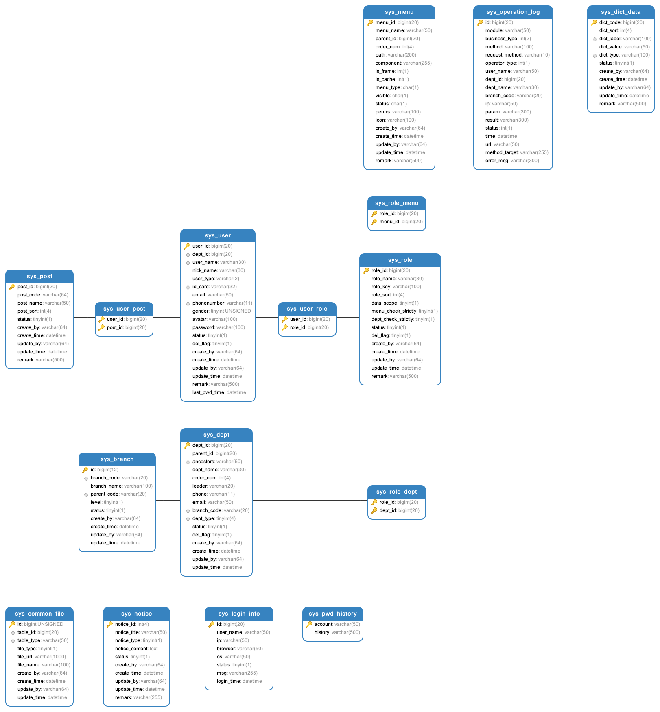

# basic-framework

    


## 项目介绍

> 基础框架,包含权限管理、操作日志、入口/出口留痕、限流等功能


## 项目结构

```
.
├── pom.xml
├──doc                 ----------------------- 文档、sql脚本
├── rjsoft-common      ----------------------- 常用模块包含通用工具类等
├── rjsoft-core        ----------------------- 模型层
├── rjsoft-dao         ----------------------- 持久层
├── rjsoft-service     ----------------------- 业务层
└── rjsoft-web         ----------------------- web层 controller、配置、aop、filter、interceptor等
```


> 文章定时任务依赖分布式定时任务调度平台[XXL-JOB](https://www.xuxueli.com/xxl-job/), 启动项目前请先启动XXL-JOB调度中心(doc文档中包含一份已编译好的调度中心可直接使用,但主要该中心数据库为公司服务器)， 如不需要此功能可删除配置文件和maven依赖中以下内容：

- 配置文件：

```yml
xxl:
  job:
    admin:
      #### 调度中心部署跟地址 [选填]：如调度中心集群部署存在多个地址则用逗号分隔。执行器将会使用该地址进行"执行器心跳注册"和"任务结果回调"；为空则关闭自动注册；
      addresses: http://127.0.0.1:8080/xxl-job-admin
      ### 执行器通讯TOKEN [选填]：非空时启用
    accessToken:
    ### 执行器AppName [选填]：执行器心跳注册分组依据；为空则关闭自动注册
    executor:
      appname: basic-framework
      ### 执行器注册 [选填]：优先使用该配置作为注册地址，为空时使用内嵌服务 ”IP:PORT“ 作为注册地址。从而更灵活的支持容器类型执行器动态IP和动态映射端口问题。
      address:
      ### 执行器IP [选填]：默认为空表示自动获取IP，多网卡时可手动设置指定IP，该IP不会绑定Host仅作为通讯实用；地址信息用于 "执行器注册" 和 "调度中心请求并触发任务"；
      ip:
      ### 执行器端口号 [选填]：小于等于0则自动获取；默认端口为9999，单机部署多个执行器时，注意要配置不同执行器端口
      port: 9999
      ### 执行器运行日志文件存储磁盘路径 [选填] ：需要对该路径拥有读写权限；为空则使用默认路径；
      logpath: ../xxl-job/jobhandler
      ### 执行器日志文件保存天数 [选填] ： 过期日志自动清理, 限制值大于等于3时生效; 否则, 如-1, 关闭自动清理功能；
      logretentiondays: 30
```

- maven依赖
```xml
    声明部分：
        <dependency>
            <groupId>com.xuxueli</groupId>
            <artifactId>xxl-job-core</artifactId>
            <version>${xxl-job.version}</version>
        </dependency>
    引用部分：
        <dependency>
            <groupId>com.xuxueli</groupId>
            <artifactId>xxl-job-core</artifactId>
        </dependency>
```

- 数据库表关系
    
    
    
## 部分组件解析及说明

### RabbitMQ

#### 消息基于什么传输？
​	信道,TCP连接的创建和销毁开销较大且并发数受系统资源限制
#### 消息路由关系怎么建立?
​	交换器、路由、绑定
​	生产者发布消息到交换器  绑定关系决定了路由到队列

#### 常用的交换器?
​	direct(路由键匹配就投递到队列) fanout(交换器级别的广播投递) topic(路由键可以匹配,匹配成功即可使来自不同消息源头的消息投递至一个队列)
#### 如何保证消息投递成功?
​	使用发送确认模式(信道设置为confirm模式),可以得知消息是否正常到达交换器

​	使用returnCallback可以得知消息正常到达与交换器绑定的队列

#### 怎么避免重复消费:
​	保证每条消息都有唯一id,一般消息正常投递后确认体(Ack)中也使用这个唯一id
​	这样可以保证投递方不会因为消费方接收到消息在未回复时断开连接或者取消订阅而重复投递
​	也可以保证消费方不会重复消费

#### 怎么避免消息丢失:
​	首先使用发送确认模式,保证无回复可以重发
​	其次消息做持久化在某些异常或者多次重发不再尝试后, 这条消息记录依然存在便于后续处理
​	开启持久化queue中durable设置为true

#### prefetchCount和concurrentConsumers的区别

​	concurrentConsumers是设置并发消费者的个数,可以进行初始化-最大值动态调整,并发消费者可以提高消息的消费能力,防止消息的堆积
​	prefechCount是每个消费者一次性从broker中取出的消息个数,提高这个参数并不能对消息实现并发消费,仅仅是减少了网络传输的时间

​	根据队列的特性可知,如果阻塞队列中一个消息阻塞了, 那么所有消息将会被阻塞,如果使用默认设置, concurrentConsumer=1, prefetchCount=250,那么当消费者队列中有一个消息由于某种原因阻塞了, 那么该消息的后续消息同样不能被消费. 为了防止这种情况的发生, 我们可以增大concurrentConsumer的设置, 使多个消费者可以并发消费. 而prefetchCount该如何设置呢? 假设conrrentConsumer=2, prefetchCount采用默认值, rabbitmq容器会初始化两个并发的消费者, 每个消费者的阻塞队列大小为250, rabbitmq的机制是将消息投递给consumer1, 先为consumer1投递满250个message, 再往consumer2投递250个message, 如果consumer1的message一直小于250个, consumer2一直处于空闲状态,那么并发消费退化为单消费者.

concurrent的值和prefetchCount可以在Rabbitmq的控制台看到:

|                                                              |              |               |      |       |             |          |         |         |         |                   |               |      |
| :----------------------------------------------------------- | :----------- | :------------ | :--- | :---- | :---------- | :------- | :------ | :------ | :------ | :---------------- | :------------ | :--- |
| Overview                                                     | Details      | Message rates | +/-  |       |             |          |         |         |         |                   |               |      |
| Channel                                                      | Virtual host | User name     | Mode | State | Unconfirmed | Prefetch | Unacked | publish | confirm | unroutable (drop) | deliver / get | ack  |
| [192.168.15.253:3150 (1)](http://218.28.133.52:9977/#/channels/192.168.15.253%3A3150 -> 172.18.0.4%3A5672 (1)) | johnyehyo    | admin         | C    | idle  | 0           | 250      | 0       |         |         |                   |               |      |
| [192.168.15.253:3150 (10)](http://218.28.133.52:9977/#/channels/192.168.15.253%3A3150 -> 172.18.0.4%3A5672 (10)) | johnyehyo    | admin         | C    | idle  | 0           | 250      | 0       |         |         |                   |               |      |
| [192.168.15.253:3150 (11)](http://218.28.133.52:9977/#/channels/192.168.15.253%3A3150 -> 172.18.0.4%3A5672 (11)) | johnyehyo    | admin         | C    | idle  | 0           | 250      | 0       |         |         |                   |               |      |
| [192.168.15.253:3150 (12)](http://218.28.133.52:9977/#/channels/192.168.15.253%3A3150 -> 172.18.0.4%3A5672 (12)) | johnyehyo    | admin         | C    | idle  | 0           | 250      | 0       |         |         |                   |               |      |
| [192.168.15.253:3150 (13)](http://218.28.133.52:9977/#/channels/192.168.15.253%3A3150 -> 172.18.0.4%3A5672 (13)) | johnyehyo    | admin         | C    | idle  | 0           | 250      | 0       |         |         |                   |               |      |
| [192.168.15.253:3150 (14)](http://218.28.133.52:9977/#/channels/192.168.15.253%3A3150 -> 172.18.0.4%3A5672 (14)) | johnyehyo    | admin         | C    | idle  | 0           | 250      | 0       |         |         |                   |               |      |
| [192.168.15.253:3150 (15)](http://218.28.133.52:9977/#/channels/192.168.15.253%3A3150 -> 172.18.0.4%3A5672 (15)) | johnyehyo    | admin         | C    | idle  | 0           | 250      | 0       |         |         |                   |               |      |
| [192.168.15.253:3150 (16)](http://218.28.133.52:9977/#/channels/192.168.15.253%3A3150 -> 172.18.0.4%3A5672 (16)) | johnyehyo    | admin         | C    | idle  | 0           | 250      | 0       |         |         |                   |               |      |
| [192.168.15.253:3150 (2)](http://218.28.133.52:9977/#/channels/192.168.15.253%3A3150 -> 172.18.0.4%3A5672 (2)) | johnyehyo    | admin         | C    | idle  | 0           | 250      | 0       |         |         |                   |               |      |
| [192.168.15.253:3150 (3)](http://218.28.133.52:9977/#/channels/192.168.15.253%3A3150 -> 172.18.0.4%3A5672 (3)) | johnyehyo    | admin         | C    | idle  | 0           | 250      | 0       |         |         |                   |               |      |
| [192.168.15.253:3150 (4)](http://218.28.133.52:9977/#/channels/192.168.15.253%3A3150 -> 172.18.0.4%3A5672 (4)) | johnyehyo    | admin         | C    | idle  | 0           | 250      | 0       |         |         |                   |               |      |
| [192.168.15.253:3150 (5)](http://218.28.133.52:9977/#/channels/192.168.15.253%3A3150 -> 172.18.0.4%3A5672 (5)) | johnyehyo    | admin         | C    | idle  | 0           | 250      | 0       |         |         |                   |               |      |
| [192.168.15.253:3150 (6)](http://218.28.133.52:9977/#/channels/192.168.15.253%3A3150 -> 172.18.0.4%3A5672 (6)) | johnyehyo    | admin         | C    | idle  | 0           | 250      | 0       |         |         |                   |               |      |
| [192.168.15.253:3150 (7)](http://218.28.133.52:9977/#/channels/192.168.15.253%3A3150 -> 172.18.0.4%3A5672 (7)) | johnyehyo    | admin         | C    | idle  | 0           | 250      | 0       |         |         |                   |               |      |
| [192.168.15.253:3150 (8)](http://218.28.133.52:9977/#/channels/192.168.15.253%3A3150 -> 172.18.0.4%3A5672 (8)) | johnyehyo    | admin         | C    | idle  | 0           | 250      | 0       |         |         |                   |               |      |
| [192.168.15.253:3150 (9)](http://218.28.133.52:9977/#/channels/192.168.15.253%3A3150 -> 172.18.0.4%3A5672 (9)) | johnyehyo    | admin         | C    | idle  | 0           | 250      | 0       |         |         |                   |               |      |


#### 消息积压

什么情况下会出现消息堆积问题？

1. 当生产者生产速度远远消费者消费速度
2. 当消费者宕机没有及时重启

那么如何解决这个问题？通常思路如下：

1. 在消费者机器重启后，增加更多的消费者进行处理

2. 在消费者处理逻辑内部开辟线程池，利用多线程的方式提高处理速度

3. 扩大队列的容量，提高堆积上限

4. 惰性队列(lazy.queue)

   什么是惰性队列？我们认识一下惰性队列的几个特性：

    - 接收到消息后直接存入磁盘而非内存
    - 消费者要消费消息时才会从磁盘中读取并加载到内存中
    - 它支持百万级消息的存储

   就是利用磁盘的缓冲机制，而这种机制的缺点就是消息的时效性会降低，性能受限于磁盘的IO

#### 各种队列形式示例

在MqController中分别列出了发送消息 、发送延迟消息、发送带有回复的消息、多个队列且队列并发控制、通配符接收消息、通配符接收消息、多个队列同时接收消息集中模式

